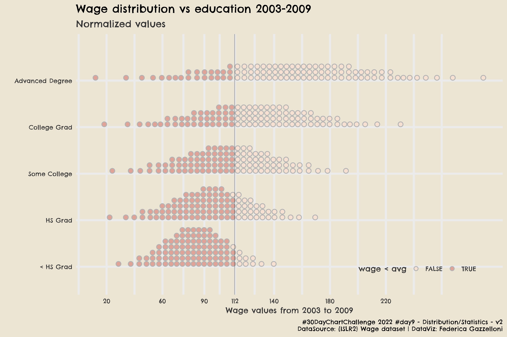
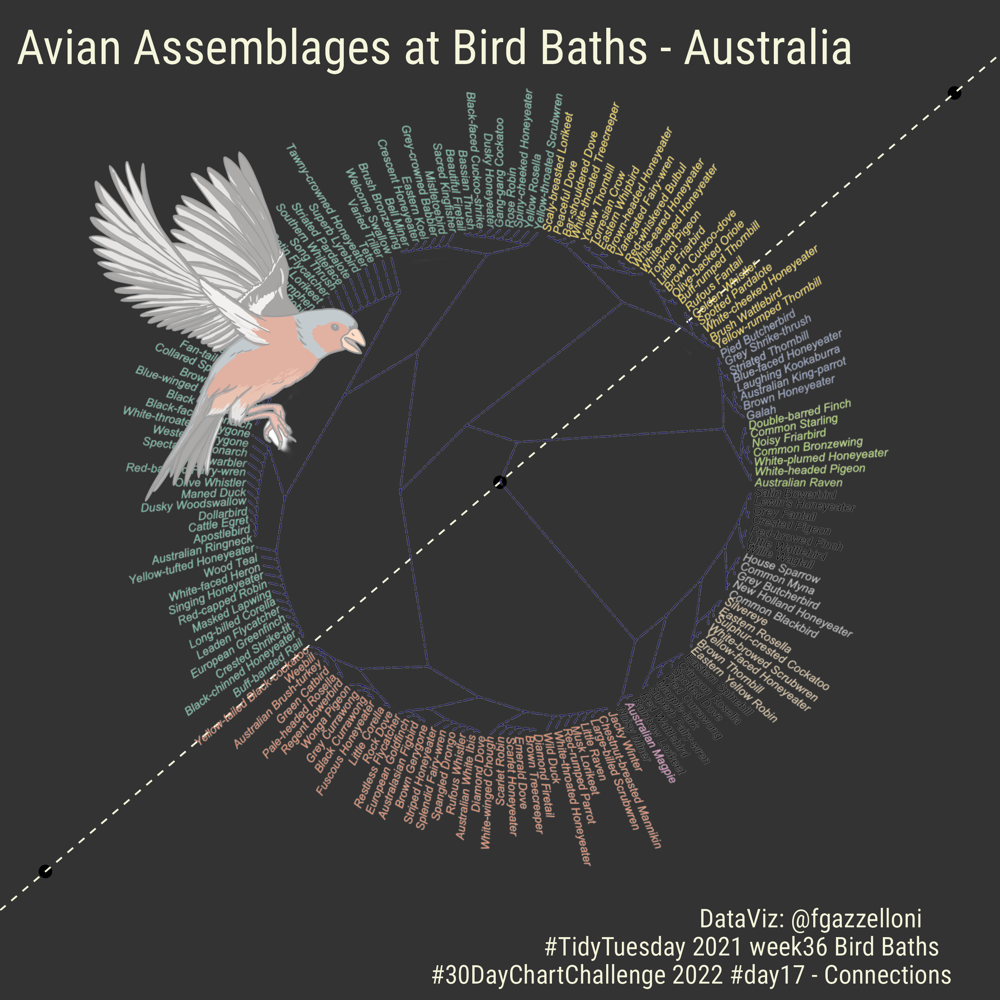
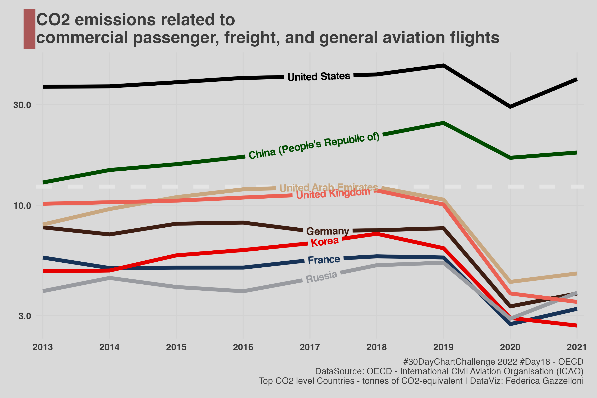
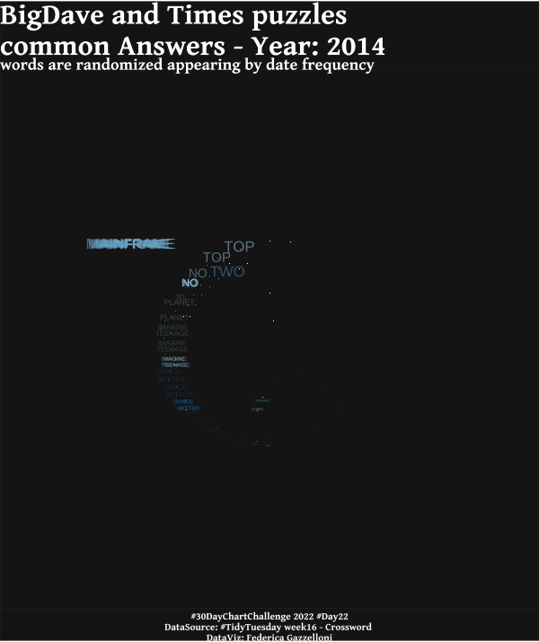
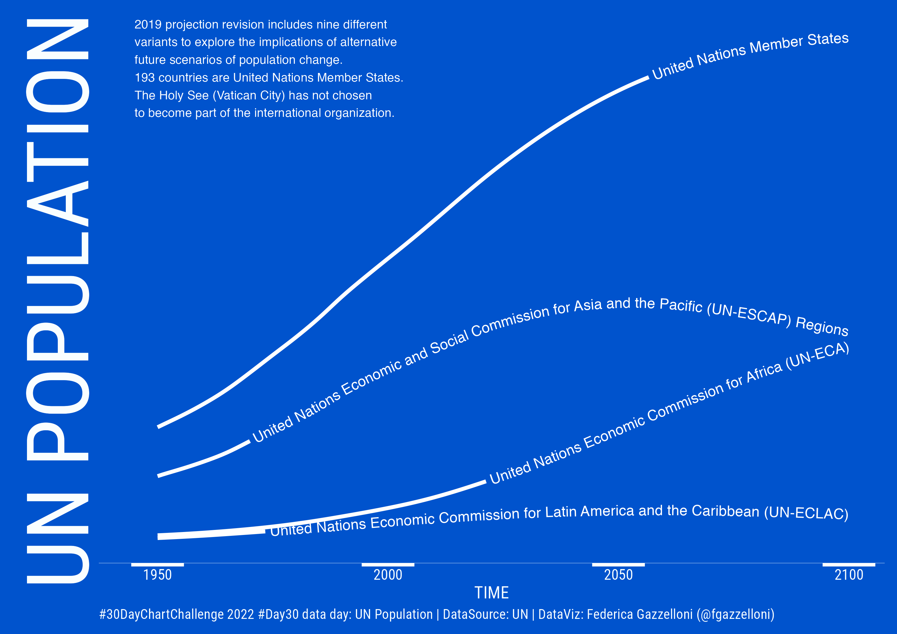

# 30DayChartChallenge

## This is a competition that takes place every year in April. In this repository you'll find all my contributions to: [#30DayChartChallenge](https://fgazzelloni.quarto.pub/30daychartchallenge/).

#### Contributions (2021 competition): [chart challenge 2021](https://github.com/Fgazzelloni/rstats-chart-challenge-2021)
#### Contributions (2022 competition): [chart challenge 2022](https://github.com/Fgazzelloni/30DayChartChallenge/tree/main/data/Edition_2022)

# `#30DayChartChallenge Topics by Day`

  

### These are the contribution for 2022

| Day | Theme | Data | my contribution 
| :---: | :---: | :--- | :--- 
| 1 | part-to-whole | [Collegiate Sports Budgets](https://github.com/rfordatascience/tidytuesday/blob/master/data/2022/2022-03-29/readme.md) | 
| 2 | pictogram | [Accidental deaths](https://www.statista.com/statistics/529312/sweden-number-of-accidental-deaths-by-type-and-gender/) | 
| 3 | historical | [DuBoisChallenge 2022 - N°8](https://github.com/ajstarks/dubois-data-portraits/tree/master/challenge/2022) | 
| 4 | flora | Iris dataset | 
| 5 | slope | [Digital Publications](https://github.com/rfordatascience/tidytuesday/blob/master/data/2022/2022-04-05/readme.md) | 
| 6 | data day | [OWID](https://ourworldindata.org/) | 
| 7 | physical | [OWID](https://ourworldindata.org/grapher/violence-against-children?country=~OWID_WRL) | 
| 8 | mountains | [arcgis](https://learn.arcgis.com/en/projects/map-the-highest-mountains/) | 
| 9 | statistics |  | 
| 10 | experimental | airquality {datasets} | 
| 11 | circular | JohnsonJohnson {datasets} | 
| 12 | theme day: The Economist | [Indoor Air Pollution](https://github.com/rfordatascience/tidytuesday/blob/master/data/2022/2022-04-12/readme.md)| 
| 13 | correlation | [Women in STEM](https://ncses.nsf.gov/pubs/nsb20221/u-s-and-global-stem-education-and-labor-force) | 
| 14 | 3-dimensional | [[Women in STEM]](https://ncses.nsf.gov/pubs/nsb20212/data) | 
| 15 | multivariate | Wage{ISLR2} | 
| 16 | environment | [indoor_pollution](https://raw.githubusercontent.com/rfordatascience/tidytuesday/master/data/2022/2022-04-12/indoor_pollution.csv) | 
| 17 | connections | [bird_baths](https://raw.githubusercontent.com/rfordatascience/tidytuesday/master/data/2021/2021-08-31/bird_baths.csv)| 
| 18 | data day | [OECD](https://www.oecd-ilibrary.org/environment/data/oecd-environment-statistics/air-transport-co2-emissions_13d4f295-en) | 
| 19 | global change | [airtransport]((https://www.oecd-ilibrary.org/environment/data/oecd-environment-statistics/air-transport-co2-emissions_13d4f295-en)) | 
| 20 | new tool | [peacekeeping](https://www.datawrapper.de/) | 
| 21 | down/upwards | [chocolate](https://raw.githubusercontent.com/rfordatascience/tidytuesday/master/data/2022/2022-01-18/chocolate.csv)| 
| 22 | animation | [Crossword Puzzles and Clues](https://github.com/rfordatascience/tidytuesday/blob/master/data/2022/2022-04-19/readme.md) | 
| 23 | tiles | [ourworldindata](https://ourworldindata.org/financing-education) | 
| 24 | theme day: Financial Times |[ourworldindata](https://ourworldindata.org/financing-education) | 
| 25 | trend | [NASA](https://climate.nasa.gov/vital-signs/global-temperature/) | 
| 26 | interactive | [Bitcoin](https://bookdown.org/content/b298e479-b1ab-49fa-b83d-a57c2b034d49/evolution.html) | 
| 27 | future | [NCDC-NOAA](https://www.ncei.noaa.gov/orders/cdo/2960933.csv)| 
| 28 | deviations | [Kaggle Hidden Gems](https://github.com/rfordatascience/tidytuesday/blob/master/data/2022/2022-04-26/readme.md) | 
| 29 | storytelling | [Solar/Wind utilities](https://github.com/rfordatascience/tidytuesday/blob/master/data/2022/2022-05-03/readme.md) | 
| 30 | data day | [UN Population](https://population.un.org/wpp/) | 
